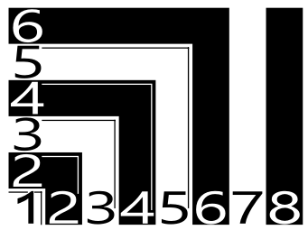
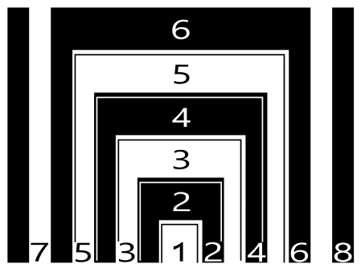
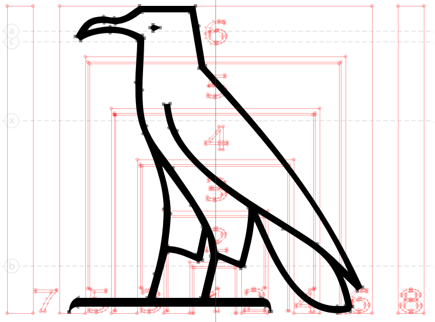
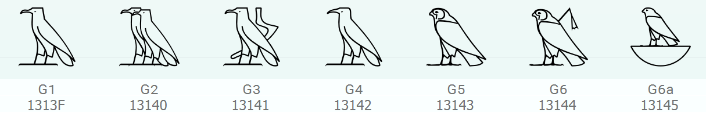
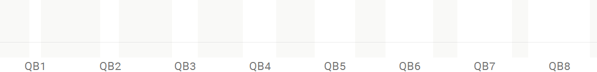
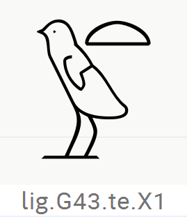
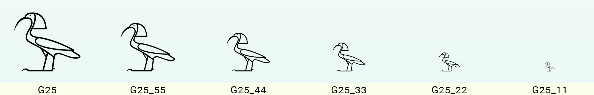
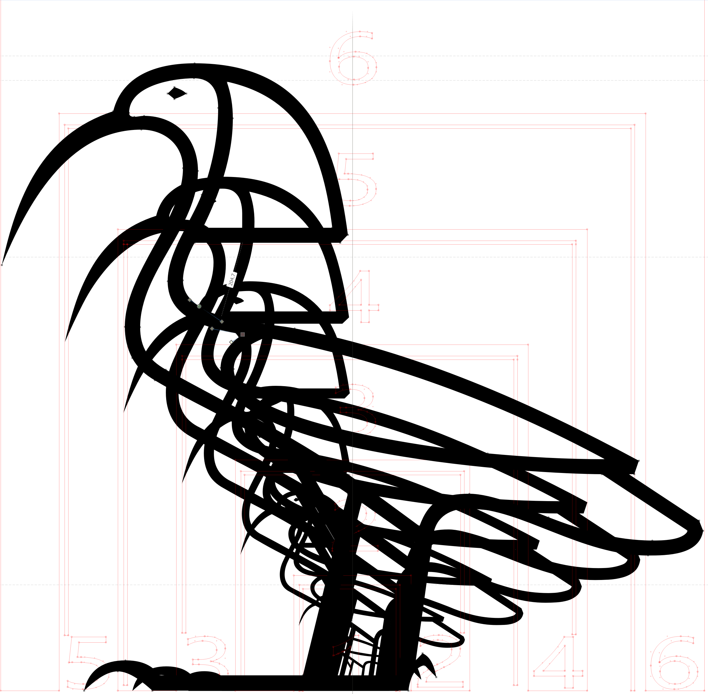
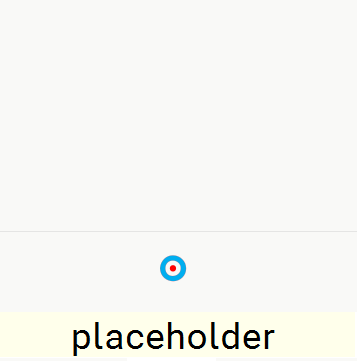

# Egyptian OpenType
This project parses an existing Egyptian Hieroglyphic font and generates a new font containing VOLT OpenType source code that can then be compiled using Microsoft's [Visual OpenType Layout Tool (VOLT)](https://learn.microsoft.com/en-us/typography/tools/volt/). Once compiled, the new font contains all of the OpenType logic needed to render Egyptian Hieroglyphic text with the [Unicode 15 format controls](http://unicode.org/charts/PDF/U13430.pdf). Correct rendering of the OpenType tables for blocks of Egyptian Hieroglyphs depends on font rendering via the [Universal Shaping Engine](https://learn.microsoft.com/en-us/typography/script-development/use) and its Hieroglyph cluster model:

>`SB* G [VS] [HR] [HM] SE* ( J SB* G [VS] [HR] [HM] SE* )*`

Details of the rendering expectations for the format controls are documented in the Uncode proposals which encoded the format controls:
 
 - Glass, Hafemann, Nederhof, Polis, Richmond, Rosmorduc and Schweitzer. 2017. “A method for encoding Egyptian quadrats in Unicode.” *Unicode Document Register for 2017*. [L2/17-112R](https://www.unicode.org/L2/L2017/17112r-quadrat-encoding.pdf).
 - Glass, Grotenhuis, Nederhof, Polis, Rosmorduc, and Werning. 2021. “Additional control characters for Ancient Egyptian hieroglyphic texts.” *Unicode Document Register for 2021*. [L2/21-208](https://www.unicode.org/L2/L2021/21208-egyptian-ctrl.pdf).

## OpenType strategy
This project generates OpenType tables for a suitable font that acheives arbitrary block formation of Egyptian Hieroglyphs using the following strategy:

1. Substitue any ligature glyphs. Conventionally, the project uses the &lt;haln&gt; feature to group lookups for this step.
2. Analyze the format controls and define the block structure using invisible glyphs as markers. The &lt;pres&gt; feature is used to group lookups for this step.
3. Determine the size of the outer, level 0, structure and areas to host glyphs. The &lt;rlig&gt; feature is used to group lookups for this step.
4. Determine the size of the intermediate, level 1, structure and areas to host glyphs. The &lt;blws&gt; feature is used to group lookups for this step.
5. Determine the size of the inner, level 2, structure and areas to host glyphs. The &lt;abvs&gt; feature is used to group lookups for this step.
6. Select the appropriate base glyph for the size and context. Also, select the largest available glyph that can fit in its hosting area. The &lt;psts&gt; feature is used to group lookups for this step.
7. Do any required structural and glyph adjustments for Right-to-Left, Vertical and Hieratic text.
8. Place an intial anchor on each base glyph. The &lt;mark&gt; feature is used to group lookups for this step.
9. Build up the block structure and place the sized hieroglyphs. The &lt;mkmk&gt; feature is used to group lookups for this step.
10. The &lt;dist&gt; feature is used interspersed with &lt;mkmk&gt; feature to offset specific signs.

## Files
The project consists of the following core files:

- **config.py** — specifies the per-font details such as font name, key dimensions etc.
- **eotgen.py** — runs the project. It takes a commandline parameter to specify the config file to be used.
- **eotHelper.py** — the class file containing all the logic to process the font and generate the OpenType. It includes additional functions for generating font tests and keyboard data.
- **featuredata.py** — contains static data for use in the project.
- **insertions.py** — contains per-font data specifying the size and offsets of insertion areas.
- **mark.py** — contains the data for the OpenType &lt;mark&gt; feature lookups.
- **mkmk.py** — contains the data for the OpenType &lt;mkmk&gt; feature lookups.
- **pres.py** — contains the data for the OpenType &lt;pres&gt; feature lookups.

The project may also make use of Unicode data published in [StandardizedVariants.txt](https://www.unicode.org/Public/UCD/latest/ucd/StandardizedVariants.txt). When relevant, a copy of this file should be placed in the /src folder.

Data for other OpenType features are integrated into the EotHelper class.

## Source font

The project depends on a suitable font in order to run. The font should be a TrueType font with the following characters, glyphs and conventions:

### Glyph block structure
The purpose of the basic format controls is to specify the arrangement of hieroglyph signs in two-dimensional blocks. These blocks can be analyzed based on a grid. This project refers to the units of this grid as “hieroglyph units”. A 6x6 grid is optimal for most purposes when laying out hieroglyphs in blocks. The lengths of the horizontal and vertical hieroglyph units do not need to be equal. In general, the horizontal dimension will be slightly longer than the vertical dimension. Most characters, in their full form, can be sized within the 6x6 grid. Exceptionally, characters may be wider, requiring an 8x6 grid.

<figure>
    
    <figcaption><i>Sample Hieroglyphic grid.</i></figcaption>
</figure>

The dimensions of the horizontal ['hfu'] and vertical ['vfu'] hieroglyph units need to be defined in font units in [config.py](/config.py). The grid dimensions must also be defined in hieroglyph units ['hhu'] and ['vhu']. The special horizontal dimension ['chu'] is used to constrain block formation to blocks narrower than the maximum. For example, the widest characters might be 8 units wide, but composite blocks will be at maximum 6 units wide. Characters wider than the block max do not participate in block composition at this time.

### Glyph outline conventions
Hieroglyphs should be rendered with TrueType outlines. Signs must centered horizontally on the origin and have zero width. Signs should be offset vertically so that they sit on a baseline lower than the ASCII baseline. The vertical offset is defined by the property ['vbase'] in [config.py](/config.py). In order to size signs efficiently, it is desirable to have a mask layer in the font that renders the defined grid dimensions centered on the origin.

<figure>
    
    <figcaption><i>Centered Hieroglyphic grid.</i></figcaption>
</figure>

With this centered grid, it is easy to see the dimensions of a sign placed correctly, for example, the glyph for G1 is 6x6 hieroglyph units with baseline at -284 font units.

<figure>
    
    <figcaption><i>Sample showing G1 glyph on grid.</i></figcaption>
</figure>

### Core Egyptian Unicode Characters
#### Egyptian Hieroglyphs
The basic hierglyph signs with the exception of the signs which participate in enclosures (i.e., U+13000–13257, U+1325E–13285, U+1328A–13378, U+1337C–1342E). The font should include one or more Egyptian Hieroglyph characters. Some fonts will choose to include a subset of characters for stylistic, corpus, or other purposes. Characters should be named after their Gardiner names without padding zeros (e.g., G1). Character variants may be suffixed with a lowercase letter (e.g., G7a). As such, Hieroglyph character names conform to the regular expression:
> ^[A-Z]+[0-9]+[a-m]?

Note, at this time, there are no character variants requiring lower case extensions beyond l, i.e., 12 variants.

<figure>
    
    <figcaption><i>Sample hieroglyph characters.</i></figcaption>
</figure>

#### Enclosure ends
The enclosure ends get special treatment. They do not have to be included, but if included they should be named as follows:

| Sign | Code point | Name | Description |
| ---- | ---------- | ---- | ----------- |
| 𓉘 | U+13258 | hwtb | HWT enclosure begin |
| 𓉙 | U+13259 | hwtbb | HWT enclosure bottom (corner) begin |
| 𓉚 | U+1325A | hwttb | HWT enclosure top (corner) begin |
| 𓉛 | U+1325B | hwtte | HWT enclosure top (corner) end |
| 𓉜 | U+1325C | hwtbe | HWT enclosure bottom (corner) end |
| 𓉝 | U+1325D | hwte | HWT enclosure end |
| 𓊆 | U+13286 | cwb | Cartouche walled begin |
| 𓊇 | U+13287 | cwe | Cartouche walled end |
| 𓊈 | U+13288 | cwb | HWT walled begin |
| 𓊉 | U+13289 | cwe | HWT walled end |
| 𓍹 | U+13379 | cb | Cartouche begin |
| 𓍺 | U+1337A | cwe | Cartouche end |
| 𓍻 | U+1337B | cre | Cartouche reversed end |
| 𓐯 | U+1342F | crb | Cartouche reversed begin |

#### Egyptian Hieroglyph Format Controls
The format controls should have conventional visible forms for fallback purposes. Only a subset need be included. When included, they should be named as follows:

| Sign | Code point | Name | Description |
| ---- | ---------- | ---- | ----------- |
| 𓐰 | U+13430 | vj | Vertical joiner |
| 𓐱 | U+13431 | hj | Horizontal joiner |
| 𓐲 | U+13432 | ts | Insertion top start |
| 𓐳 | U+13433 | bs | Insertion bottom start |
| 𓐴 | U+13434 | te | Insertion top end |
| 𓐵 | U+13435 | be | Insertion bottom end |
| 𓐶 | U+13436 | om | Overlay middle |
| 𓐷 | U+13437 | ss | Segment start |
| 𓐸 | U+13438 | se | Segment end |
| 𓐹 | U+13439 | mi | Middle insertion |
| 𓐺 | U+1343A | ti | Top insertion |
| 𓐻 | U+1343B | bi | Bottom insertion |
| 𓐼 | U+1343C | esb | Enclosure single begin |
| 𓐽 | U+1343D | ese | Enclosure single end |
| 𓐾 | U+1343E | ewb | Enclosure walled begin |
| 𓐿 | U+1343F | ewe | Enclosure walled end |
| 𓑀 | U+13440 | mr | Mirror horizontally |
| 𓑁 | U+13441 | BF1 | Blank full |
| 𓑂 | U+13442 | BQ1 | Blank quarter |
| 𓑃 | U+13443 | LF1 | Lost sign full |
| 𓑄 | U+13444 | LQ1 | Lost sign quarter |
| 𓑅 | U+13445 | LT1 | Lost sign tall |
| 𓑆 | U+13446 | LW1 | Lost sign wide |
| 𓑇 | U+13447 | dq1 | Damaged quarter 1 |
| 𓑈 | U+13448 | dq2 | Damaged quarter 2 |
| 𓑉 | U+13449 | dq12 | Damaged quarter 12 |
| 𓑊 | U+1344A | dq3 | Damaged quarter 3 |
| 𓑋 | U+1344B | dq13 | Damaged quarter 13 |
| 𓑌 | U+1344C | dq23 | Damaged quarter 23 |
| 𓑍 | U+1344D | dq123 | Damaged quarter 123 |
| 𓑎 | U+1344E | dq4 | Damaged quarter 4 |
| 𓑏 | U+1344F | dq14 | Damaged quarter 14 |
| 𓑐 | U+13450 | dq24 | Damaged quarter 24 |
| 𓑑 | U+13451 | dq124 | Damaged quarter 124 |
| 𓑒 | U+13452 | dq34 | Damaged quarter 34 |
| 𓑓 | U+13453 | dq134 | Damaged quarter 134 |
| 𓑔 | U+13454 | dq234 | Damaged quarter 234 |
| 𓑕 | U+13455 | df | Damaged full    1234 |

#### Variation Selectors
Signs for the variation selectors should be included for fallback purposes (U+FE00–FE02). These signs need not be included if the rotational and other variants are not supported by the font.

### Recommended Unicode Characters
#### Latin letters
OpenType Egyptian Hieroglyphic fonts work best when they include Latin characters to support input. In addition to the [ASCII range](http://unicode.org/charts/PDF/U0000.pdf), Latin coverage should include Egyptological transliteration characters, as follows:

| Sign | Code point | Description |
| ---- | ---------- | ----------- |
| Č | U+010C | LATIN CAPITAL LETTER C WITH CARON |
| č | U+010D | LATIN SMALL LETTER C WITH CARON |
| Ś | U+015A | LATIN CAPITAL LETTER S WITH ACUTE |
| ś | U+015B | LATIN SMALL LETTER S WITH ACUTE |
| Š | U+0160 | LATIN CAPITAL LETTER S WITH CARON |
| š | U+0161 | LATIN SMALL LETTER S WITH CARON |
| Ť | U+0164 | LATIN CAPITAL LETTER T WITH CARON |
| ť | U+0165 | LATIN SMALL LETTER T WITH CARON |
| Ž | U+017D | LATIN CAPITAL LETTER Z WITH CARON |
| ž | U+017E | LATIN SMALL LETTER Z WITH CARON |
| Ḏ | U+1E0E | LATIN CAPITAL LETTER D WITH LINE BELOW |
| ḏ | U+1E0F | LATIN SMALL LETTER D WITH LINE BELOW |
| Ḥ | U+1E24 | LATIN CAPITAL LETTER H WITH DOT BELOW |
| ḥ | U+1E25 | LATIN SMALL LETTER H WITH DOT BELOW |
| Ḫ | U+1E2A | LATIN CAPITAL LETTER H WITH BREVE BELOW |
| ḫ | U+1E2B | LATIN SMALL LETTER H WITH BREVE BELOW |
| Ḳ | U+1E32 | LATIN CAPITAL LETTER K WITH DOT BELOW |
| ḳ | U+1E33 | LATIN SMALL LETTER K WITH DOT BELOW |
| Ṭ | U+1E6C | LATIN CAPITAL LETTER T WITH DOT BELOW |
| ṭ | U+1E6D | LATIN SMALL LETTER T WITH DOT BELOW |
| Ṯ | U+1E6E | LATIN CAPITAL LETTER T WITH LINE BELOW |
| ṯ | U+1E6F | LATIN SMALL LETTER T WITH LINE BELOW |
| Ṱ | U+1E70 | LATIN CAPITAL LETTER T WITH CIRCUMFLEX BELOW |
| ṱ | U+1E71 | LATIN SMALL LETTER T WITH CIRCUMFLEX BELOW |
| ẖ | U+1E96 | LATIN SMALL LETTER H WITH LINE BELOW |
| Ꜣ | U+A722 | LATIN CAPITAL LETTER EGYPTOLOGICAL ALEF |
| ꜣ | U+A723 | LATIN SMALL LETTER EGYPTOLOGICAL ALEF |
| Ꜥ | U+A724 | LATIN CAPITAL LETTER EGYPTOLOGICAL AIN |
| ꜥ | U+A725 | LATIN SMALL LETTER EGYPTOLOGICAL AIN |
| Ꞽ | U+A7BC | LATIN CAPITAL LETTER GLOTTAL I |
| ꞽ | U+A7BD | LATIN SMALL LETTER GLOTTAL I |

**Note** — glyph names for these characters are unimportant as they are not included in the generation of OpenType layout tables. OpenType tables for the Latin range is outside of the scope of this project.

#### Egyptological brackets
The following brackets should be included if support for Egyptological transliteration is intended. These brackets may also participate in Hieroglyph cluster formation in supporting software.

| Sign | Code point | Description |
| ---- | ---------- | ----------- |
| [ | U+005B | LEFT SQUARE BRACKET |
| ] | U+005D | RIGHT SQUARE BRACKET |
| { | U+007B | LEFT CURLY BRACKET |
| } | U+007D | RIGHT CURLY BRACKET |
|  | U+27E6 | MATHEMATICAL LEFT WHITE SQUARE BRACKET |
|  | U+27E7 | MATHEMATICAL RIGHT WHITE SQUARE BRACKET |
| ⟨ | U+27E8 | MATHEMATICAL LEFT ANGLE BRACKET |
| ⟩ | U+27E9 | MATHEMATICAL RIGHT ANGLE BRACKET |
| ⸢ | U+2E22 | TOP LEFT HALF BRACKET |
| ⸣ | U+2E23 | TOP RIGHT HALF BRACKET |
| ⸤ | U+2E24 | BOTTOM LEFT HALF BRACKET |
| ⸥ | U+2E25 | BOTTOM RIGHT HALF BRACKET |

#### Directional controls and joiners
when right-to-left layout support is planned, fonts should include glyphs for the directional controls and joiners:

| Code point | Description |
| ---------- | ----------- |
| U+200C | ZERO WIDTH NON-JOINER |
| U+200D | ZERO WIDTH JOINER |
| U+200E | LEFT-TO-RIGHT MARK |
| U+200F | RIGHT-TO-LEFT MARK |

#### Generic bases
The generic base U+25CC DOTTED CIRCLE may be included in a font for participation in Hieroglyph cluster formation.

| Sign | Code point | Name | Description |
| ---- | ---------- | ---- | ----------- |
| ◌ | U+25CC | dottedcircle | DOTTED CIRCLE |

### Variants
Unicode 15 introduced variation sequences for Egyptian Hieroglyphs. The sequences are defined in [StandardizedVariants.txt](https://www.unicode.org/Public/UCD/latest/ucd/StandardizedVariants.txt). There are two kinds:

#### Rotational variants
A hieroglyph character may be followed by a variation selector (currently U+FE00–FE02). When such a sequence is defined in [StandardizedVariants.txt](https://www.unicode.org/Public/UCD/latest/ucd/StandardizedVariants.txt), the glyph should be mapped to a rotated version of the same base hieroglyph. The rotation amount is determined by the variation selector used. A font that intends to support the rotational variants should include the appropriate glyphs marked according to their rotation:

- A1  — the A1 hieroglyph
- A1n — the A1 hieroglyph rotated by 90 degrees
- A1o — the A1 hieroglyph rotated by 180 degrees
- A1t — the A1 hieroglyph rotated by 270 degrees

Glyphs having names marking rotational variants are identified during processing. The EOT project generates the appropriate entries in the font's cmap table.

#### Expanded variants
The lost sign hieroglyphs may be followed by the variation selector U+FE00 to select a variant lost sign that does not leave a white border around the edge of the sign area. The variant lost signs are designated as follows:

| Code point | Name | Description |
| ---------- | ---- | ----------- |
| U+13443 U+FE00 | LF2 | Lost sign full expanded |
| U+13444 U+FE00 | LQ2 | Lost sign quarter expanded |
| U+13445 U+FE00 | LT2 | Lost sign tall expanded |
| U+13446 U+FE00 | LW2 | Lost sign wide expanded |

As with the rotational variants, entries for the lost sign variants, when present, are added to the font's cmap table.

### Unmapped Glyphs
This OpenType project depends on a large number of unmapped glyphs that can only be accessed as a result of OpenType processing.

#### Quadrat bases
All Egyptian Hieroglyphic signs are treated as mark glyph in the OpenType project. The block calculation determines the appropriate width for the block and then selects an empty glyph to serve as the base on which the marks are placed. These are named "QB" followed by a digit for the width of the base:
<figure>
    
    <figcaption><i>Quadrat bases for widths 1 to 8.</i></figcaption>
</figure>

#### Enclosure pieces
#### Generic boxes
#### Open segments
#### Text critical marks
#### Lost sign size variants
#### Lost sign expanded variants
#### Damaged sign variants
#### Ligatures
Ligatures can be defined on-demand to represent a particular combination with higher typographic fidelity than can be acheived with the dynamic construction. Ligatures must be named using a prefix "lig." followed by a period delimited sequence of glyphnames based on the glyph sequence they ligate. For example, glyph "lig.G43.te.X1" defines the ligature:
<figure>
    
    <figcaption><i>Ligature of G43, top end insertion, and X1.</i></figcaption>
</figure>

#### Size variants
Size variant glyphs are included in the font so that the OpenType logic can select the largest available glyph that will fit in the host area. For example, the hieroglyph G25 has a natural size 6x6. If this hieroglyph occurs in a block that has only a 4x4 area available to host G25, and the font contains a size variant of G25 called G25_44, it will select that variant to use when rendering the block. Consequently, a font should contain a range of size variant glyphs appropriate to each hieroglyph. There is no minimum requirement for the font to contain such variants. If the OpenType logic determines that a suitablely sized glyph is not available in a required size for a given base hieroglyph, it will fall back to a special glyph called "placeholder". The natural size of the placeholder glyph should be 1x1 so that it will fit in any supported size determined by the block structure logic.

<figure>
    
    <figcaption><i>Size variants of G25.</i></figcaption>
</figure>

<figure>
    
    <figcaption><i>Overlaid size variants of G25.</i></figcaption>
</figure>

<figure>
    
    <figcaption><i>The placeholder glyph.</i></figcaption>
</figure>

#### Mirror variants
Mirrored variants are included in the font so that the OpenType logic can support both forced RTL layout, and the mirror control.
- Forced RTL layout mirrors the entire run being forced. The mirroring applies to whole blocks and reflects both the block structure and individual signs. Signs that have horizontal symmetry do not mirror.
- The mirror control applies to the immediately preceeding sign only, and does not affect block structures. Signs that have horizontal symmetry do not mirror and the mirror control remains visible in the glyph run.

The signs that mirror horizontally are defined in [featuredata.py](/featuredata.py) mirroring.
 
When both mirror variants and rotational variants are supported by a font, the corresponding set of mirrored forms for the rotational variants should also be included. The set of rotational variants that mirror is defined separately from the mirror variants, in [featuredata.py](/featuredata.py) mirroredvariants.

