# Egyptian Text font
A reference font demonstrating the user of Egyptian Hieroglyphic format controls is available [here](https://github.com/microsoft/font-tools/tree/main/EgyptianOpenType/font). This font is made available under the SIL Open Font License.

# Egyptian OpenType
This project parses an existing Egyptian Hieroglyphic font and generates a new font containing VOLT OpenType source code that can then be compiled using Microsoft's [Visual OpenType Layout Tool (VOLT)](https://learn.microsoft.com/en-us/typography/tools/volt/). Once compiled, the new font contains all of the OpenType logic needed to render Egyptian Hieroglyphic text with the [Unicode 15 format controls](http://unicode.org/charts/PDF/U13430.pdf). Correct rendering of the OpenType tables for blocks of Egyptian Hieroglyphs depends on font rendering via the [Universal Shaping Engine](https://learn.microsoft.com/en-us/typography/script-development/use) and its Hieroglyph cluster model:

>`SB* G [VS] [HR] [HM] SE* ( J SB* G [VS] [HR] [HM] SE* )*`

Details of the rendering expectations for the format controls are documented in the Unicode proposals which encoded the format controls:
 
 - Glass, Hafemann, Nederhof, Polis, Richmond, Rosmorduc and Schweitzer. 2017. “A method for encoding Egyptian quadrats in Unicode.” *Unicode Document Register for 2017*. [L2/17-112R](https://www.unicode.org/L2/L2017/17112r-quadrat-encoding.pdf).
 - Glass, Grotenhuis, Nederhof, Polis, Rosmorduc, and Werning. 2021. “Additional control characters for Ancient Egyptian hieroglyphic texts.” *Unicode Document Register for 2021*. [L2/21-208](https://www.unicode.org/L2/L2021/21208-egyptian-ctrl.pdf).

## OpenType strategy
This project generates OpenType tables for a suitable font that achieves  arbitrary block formation of Egyptian Hieroglyphs using the following strategy:

1. Substitute any ligature glyphs. Conventionally, the project uses the &lt;haln&gt; feature to group lookups for this step.
2. Analyze the format controls and define the block structure using invisible glyphs as markers. The &lt;pres&gt; feature is used to group lookups for this step.
3. Determine the size of the outer, level 0, structure and areas to host glyphs. The &lt;rlig&gt; feature is used to group lookups for this step.
4. Determine the size of the intermediate, level 1, structure and areas to host glyphs. The &lt;blws&gt; feature is used to group lookups for this step.
5. Determine the size of the inner, level 2, structure and areas to host glyphs. The &lt;abvs&gt; feature is used to group lookups for this step.
6. Select the appropriate base glyph for the size and context. Also, select the largest available glyph that can fit in its hosting area. The &lt;psts&gt; feature is used to group lookups for this step.
7. Do any required structural and glyph adjustments for Right-to-Left, Vertical and Hieratic text.
8. Place an initial anchor on each base glyph. The &lt;mark&gt; feature is used to group lookups for this step.
9. Build up the block structure and place the sized hieroglyphs. The &lt;mkmk&gt; feature is used to group lookups for this step.
10. The &lt;dist&gt; feature is used interspersed with &lt;mkmk&gt; feature to offset specific signs.

## Files
The project consists of the following core files:

- **config.py** — specifies the per-font details such as font name, key dimensions etc.
- **eotgen.py** — runs the project.
- **eotHelper.py** — the class file containing all the logic to process the font and generate the OpenType. It includes additional functions for generating font tests and keyboard data.
- **featuredata.py** — contains static data for use in the project.
- **insertions.py** — contains per-font data specifying the size and offsets of insertion areas.
- **mark.py** — contains the data for the OpenType &lt;mark&gt; feature lookups.
- **mkmk.py** — contains the data for the OpenType &lt;mkmk&gt; feature lookups.
- **pres.py** — contains the data for the OpenType &lt;pres&gt; feature lookups.

The project may also make use of Unicode data published in [StandardizedVariants.txt](https://www.unicode.org/Public/UCD/latest/ucd/StandardizedVariants.txt). When relevant, a copy of this file should be placed in the /src folder.

Data for other OpenType features are integrated into the EotHelper class.

## Source font

The project depends on a suitable font in order to run. The font should be a TrueType font with the following characters, glyphs and conventions:

### Glyph block structure
The purpose of the basic format controls is to specify the arrangement of hieroglyph signs in two-dimensional blocks. These blocks can be analyzed based on a grid. This project refers to the units of this grid as “hieroglyph units”. A 6x6 grid is optimal for most purposes when laying out hieroglyphs in blocks. The lengths of the horizontal and vertical hieroglyph units do not need to be equal. In general, the horizontal dimension will be slightly longer than the vertical dimension. Most characters, in their full form, can be sized within the 6x6 grid. Exceptionally, characters may be wider, requiring an 8x6 grid.

<figure>
    
    <figcaption><i>Sample Hieroglyphic grid.</i></figcaption>
</figure>

The dimensions of the horizontal ['hfu'] and vertical ['vfu'] hieroglyph units need to be defined in font units in [config.py](/config.py). The grid dimensions must also be defined in hieroglyph units ['hhu'] and ['vhu']. The special horizontal dimension ['chu'] is used to constrain block formation to blocks narrower than the maximum. For example, the widest characters might be 8 units wide, but composite blocks will be at maximum 6 units wide. Characters wider than the block max do not participate in block composition at this time.

### Glyph outline conventions
Hieroglyphs should be rendered with TrueType outlines. Signs must be centered horizontally on the origin and have zero width. Signs should be offset vertically so that they sit on a baseline lower than the ASCII baseline. The vertical offset is defined by the property ['vbase'] in [config.py](/config.py). In order to size signs efficiently, it is desirable to have a mask layer in the font that renders the defined grid dimensions centered on the origin.

<figure>
    
    <figcaption><i>Centered Hieroglyphic grid.</i></figcaption>
</figure>

With this centered grid, it is easy to see the dimensions of a sign placed correctly, for example, the glyph for G1 is 6x6 hieroglyph units with baseline at -284 font units.

<figure>
    
    <figcaption><i>Sample showing G1 glyph on the centered grid.</i></figcaption>
</figure>

### Core Egyptian Unicode Characters
#### Egyptian Hieroglyphs
The basic hieroglyph signs with the exception of the signs which participate in enclosures (i.e., U+13000–13257, U+1325E–13285, U+1328A–13378, U+1337C–1342E). The font should include one or more Egyptian Hieroglyph characters. Some fonts will choose to include a subset of characters for stylistic, corpus, or other purposes. Characters should be named after their Gardiner names without padding zeros (e.g., G1). Character variants may be suffixed with a lowercase letter (e.g., G7a). As such, Hieroglyph character names conform to the regular expression:
> ^[A-Z]+[0-9]+[a-m]?

Note, at this time, there are no character variants requiring lower case extensions beyond l, i.e., 12 variants.

<figure>
    
    <figcaption><i>Sample hieroglyph characters.</i></figcaption>
</figure>

#### Enclosure ends
The enclosure ends get special treatment. They do not have to be included, but if included they should be named as follows:

| Sign | Code point | Glyph name | Description |
| ---- | ---------- | ---- | ----------- |
| 𓉘 | U+13258 | hwtb | HWT enclosure begin |
| 𓉙 | U+13259 | hwtbb | HWT enclosure bottom (corner) begin |
| 𓉚 | U+1325A | hwttb | HWT enclosure top (corner) begin |
| 𓉛 | U+1325B | hwtte | HWT enclosure top (corner) end |
| 𓉜 | U+1325C | hwtbe | HWT enclosure bottom (corner) end |
| 𓉝 | U+1325D | hwte | HWT enclosure end |
| 𓊆 | U+13286 | cwb | Cartouche walled begin |
| 𓊇 | U+13287 | cwe | Cartouche walled end |
| 𓊈 | U+13288 | cwb | HWT walled begin |
| 𓊉 | U+13289 | cwe | HWT walled end |
| 𓍹 | U+13379 | cb | Cartouche begin |
| 𓍺 | U+1337A | cwe | Cartouche end |
| 𓍻 | U+1337B | cre | Cartouche reversed end |
| 𓐯 | U+1342F | crb | Cartouche reversed begin |

#### Egyptian Hieroglyph Format Controls
The format controls should have conventional visible forms for fallback purposes. Only a subset need be included. When included, they should be named as follows:

| Sign | Code point | Glyph name | Description |
| ---- | ---------- | ---- | ----------- |
| 𓐰 | U+13430 | vj | Vertical joiner |
| 𓐱 | U+13431 | hj | Horizontal joiner |
| 𓐲 | U+13432 | ts | Insertion top start |
| 𓐳 | U+13433 | bs | Insertion bottom start |
| 𓐴 | U+13434 | te | Insertion top end |
| 𓐵 | U+13435 | be | Insertion bottom end |
| 𓐶 | U+13436 | om | Overlay middle |
| 𓐷 | U+13437 | ss | Segment start |
| 𓐸 | U+13438 | se | Segment end |
| 𓐹 | U+13439 | mi | Middle insertion |
| 𓐺 | U+1343A | ti | Top insertion |
| 𓐻 | U+1343B | bi | Bottom insertion |
| 𓐼 | U+1343C | esb | Enclosure single begin |
| 𓐽 | U+1343D | ese | Enclosure single end |
| 𓐾 | U+1343E | ewb | Enclosure walled begin |
| 𓐿 | U+1343F | ewe | Enclosure walled end |
| 𓑀 | U+13440 | mr | Mirror horizontally |
| 𓑁 | U+13441 | BF1 | Blank full |
| 𓑂 | U+13442 | BQ1 | Blank quarter |
| 𓑃 | U+13443 | LF1 | Lost sign full |
| 𓑄 | U+13444 | LQ1 | Lost sign quarter |
| 𓑅 | U+13445 | LT1 | Lost sign tall |
| 𓑆 | U+13446 | LW1 | Lost sign wide |
| 𓑇 | U+13447 | dq1 | Damaged quarter 1 |
| 𓑈 | U+13448 | dq2 | Damaged quarter 2 |
| 𓑉 | U+13449 | dq12 | Damaged quarter 12 |
| 𓑊 | U+1344A | dq3 | Damaged quarter 3 |
| 𓑋 | U+1344B | dq13 | Damaged quarter 13 |
| 𓑌 | U+1344C | dq23 | Damaged quarter 23 |
| 𓑍 | U+1344D | dq123 | Damaged quarter 123 |
| 𓑎 | U+1344E | dq4 | Damaged quarter 4 |
| 𓑏 | U+1344F | dq14 | Damaged quarter 14 |
| 𓑐 | U+13450 | dq24 | Damaged quarter 24 |
| 𓑑 | U+13451 | dq124 | Damaged quarter 124 |
| 𓑒 | U+13452 | dq34 | Damaged quarter 34 |
| 𓑓 | U+13453 | dq134 | Damaged quarter 134 |
| 𓑔 | U+13454 | dq234 | Damaged quarter 234 |
| 𓑕 | U+13455 | df | Damaged full    1234 |

#### Variation Selectors
Signs for the variation selectors should be included for fallback purposes (U+FE00–FE02). These signs need not be included if the rotational and other variants are not supported by the font.

### Recommended Unicode Characters
#### Latin letters
OpenType Egyptian Hieroglyphic fonts work best when they include Latin characters to support input. In addition to the [ASCII range](http://unicode.org/charts/PDF/U0000.pdf), Latin coverage should include Egyptological transliteration characters, as follows:

| Sign | Code point | Description |
| ---- | ---------- | ----------- |
| Č | U+010C | LATIN CAPITAL LETTER C WITH CARON |
| č | U+010D | LATIN SMALL LETTER C WITH CARON |
| Ś | U+015A | LATIN CAPITAL LETTER S WITH ACUTE |
| ś | U+015B | LATIN SMALL LETTER S WITH ACUTE |
| Š | U+0160 | LATIN CAPITAL LETTER S WITH CARON |
| š | U+0161 | LATIN SMALL LETTER S WITH CARON |
| Ť | U+0164 | LATIN CAPITAL LETTER T WITH CARON |
| ť | U+0165 | LATIN SMALL LETTER T WITH CARON |
| Ž | U+017D | LATIN CAPITAL LETTER Z WITH CARON |
| ž | U+017E | LATIN SMALL LETTER Z WITH CARON |
| Ḏ | U+1E0E | LATIN CAPITAL LETTER D WITH LINE BELOW |
| ḏ | U+1E0F | LATIN SMALL LETTER D WITH LINE BELOW |
| Ḥ | U+1E24 | LATIN CAPITAL LETTER H WITH DOT BELOW |
| ḥ | U+1E25 | LATIN SMALL LETTER H WITH DOT BELOW |
| Ḫ | U+1E2A | LATIN CAPITAL LETTER H WITH BREVE BELOW |
| ḫ | U+1E2B | LATIN SMALL LETTER H WITH BREVE BELOW |
| Ḳ | U+1E32 | LATIN CAPITAL LETTER K WITH DOT BELOW |
| ḳ | U+1E33 | LATIN SMALL LETTER K WITH DOT BELOW |
| Ṭ | U+1E6C | LATIN CAPITAL LETTER T WITH DOT BELOW |
| ṭ | U+1E6D | LATIN SMALL LETTER T WITH DOT BELOW |
| Ṯ | U+1E6E | LATIN CAPITAL LETTER T WITH LINE BELOW |
| ṯ | U+1E6F | LATIN SMALL LETTER T WITH LINE BELOW |
| Ṱ | U+1E70 | LATIN CAPITAL LETTER T WITH CIRCUMFLEX BELOW |
| ṱ | U+1E71 | LATIN SMALL LETTER T WITH CIRCUMFLEX BELOW |
| ẖ | U+1E96 | LATIN SMALL LETTER H WITH LINE BELOW |
| Ꜣ | U+A722 | LATIN CAPITAL LETTER EGYPTOLOGICAL ALEF |
| ꜣ | U+A723 | LATIN SMALL LETTER EGYPTOLOGICAL ALEF |
| Ꜥ | U+A724 | LATIN CAPITAL LETTER EGYPTOLOGICAL AIN |
| ꜥ | U+A725 | LATIN SMALL LETTER EGYPTOLOGICAL AIN |
| Ꞽ | U+A7BC | LATIN CAPITAL LETTER GLOTTAL I |
| ꞽ | U+A7BD | LATIN SMALL LETTER GLOTTAL I |

**Note** — glyph names for these characters are unimportant as they are not included in the generation of OpenType layout tables. OpenType tables for the Latin range is outside of the scope of this project.

#### Egyptological brackets
See [Unicode Core Spec Chapter 11, Table 11-2](https://www.unicode.org/versions/Unicode16.0.0/core-spec/chapter-11/#G47104)

The following brackets should be included if support for Egyptological transliteration is intended. These brackets may also participate in Hieroglyph cluster formation in supporting software.

| Sign | Code point | Glyph name |Description |
| ---- | ---------- | ---------- |----------- |
| [ | U+005B | tcbb | LEFT SQUARE BRACKET |
| ] | U+005D | tcbe | RIGHT SQUARE BRACKET |
| ⸢ | U+2E22 | tcub | TOP LEFT HALF BRACKET |
| ⸣ | U+2E23 | tcue | TOP RIGHT HALF BRACKET |
| ⟨ | U+27E8 | tcab | MATHEMATICAL LEFT ANGLE BRACKET |
| ⟩ | U+27E9 | tcae | MATHEMATICAL RIGHT ANGLE BRACKET |
| { | U+007B | tccb | LEFT CURLY BRACKET |
| } | U+007D | tcce | RIGHT CURLY BRACKET |
| ⟦ | U+27E6 | tcrb | MATHEMATICAL LEFT WHITE SQUARE BRACKET |
| ⟧ | U+27E7 | tcre | MATHEMATICAL RIGHT WHITE SQUARE BRACKET |

#### Directional controls and joiners
when right-to-left layout support is planned, fonts should include glyphs for the directional controls and joiners:

| Code point | Description |
| ---------- | ----------- |
| U+200C | ZERO WIDTH NON-JOINER |
| U+200D | ZERO WIDTH JOINER |
| U+200E | LEFT-TO-RIGHT MARK |
| U+200F | RIGHT-TO-LEFT MARK |

#### Generic bases
The generic base U+25CC DOTTED CIRCLE may be included in a font for participation in Hieroglyph cluster formation.

| Sign | Code point | Name | Description |
| ---- | ---------- | ---- | ----------- |
| ◌ | U+25CC | dottedcircle | DOTTED CIRCLE |

### Variants
Unicode 15 introduced variation sequences for Egyptian Hieroglyphs. The sequences are defined in [StandardizedVariants.txt](https://www.unicode.org/Public/UCD/latest/ucd/StandardizedVariants.txt). There are two kinds:

#### Rotational variants
A hieroglyph character may be followed by a variation selector (currently U+FE00–FE02). When such a sequence is defined in [StandardizedVariants.txt](https://www.unicode.org/Public/UCD/latest/ucd/StandardizedVariants.txt), the glyph should be mapped to a rotated version of the same base hieroglyph. The rotation amount is determined by the variation selector used. A font that intends to support the rotational variants should include the appropriate glyphs marked according to their rotation:

- A1  — the A1 hieroglyph
- A1n — the A1 hieroglyph rotated by 90 degrees
- A1o — the A1 hieroglyph rotated by 180 degrees
- A1t — the A1 hieroglyph rotated by 270 degrees

Glyphs having names marking rotational variants are identified during processing. The EOT project generates the appropriate entries in the font's cmap table.

#### Expanded variants
The lost sign hieroglyphs may be followed by the variation selector U+FE00 to select a variant lost sign that does not leave a white border around the edge of the sign area. The variant lost signs are designated as follows:

| Code point | Name | Description |
| ---------- | ---- | ----------- |
| U+13443 U+FE00 | LF2 | Lost sign full expanded |
| U+13444 U+FE00 | LQ2 | Lost sign quarter expanded |
| U+13445 U+FE00 | LT2 | Lost sign tall expanded |
| U+13446 U+FE00 | LW2 | Lost sign wide expanded |

As with the rotational variants, entries for the lost sign variants, when present, are added to the font's cmap table.

### Unmapped Glyphs
This OpenType project depends on a large number of unmapped glyphs that can only be accessed as a result of OpenType processing.

#### Quadrat bases
All Egyptian Hieroglyphic signs are treated as mark glyph in the OpenType project. The block calculation determines the appropriate width for the block and then selects an empty glyph to serve as the base on which the marks are placed. These are named "QB" followed by a digit for the width of the base:

<figure>
    
    <figcaption><i>Quadrat bases for widths 1 to 8.</i></figcaption>
</figure>

#### Enclosure pieces
Cartouche enclosures are formed by replacing the quadrat bases with the cartouche base for the corresponding width. They are named "QC" followed by a digit for their width:

<figure>
    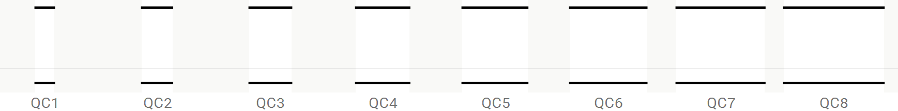
    <figcaption>
        <i>Quadrat cartouche bases for widths 1 to 8.</i>
    </figcaption>
</figure>

The cartouche bases have rotated forms for vertical layout. The width of the column is unform so that the enclosing lines of the cartouche accommodate different quadrat widths within. The space for the quadrat width is centered within the enclosing lines. These forms append "V" to the corresponding name:

<figure>
    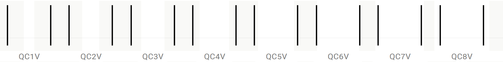
    <figcaption>
        <i>Quadrat cartouche bases for vertical layout.</i>
    </figcaption>
</figure>

Walled bases are needed for the walled cartouches. They are named "QW" followed by the digit for their width. They also have corresponding vertical forms.

<figure>
    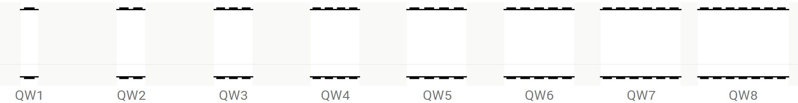
    <figcaption>
        <i>Walled cartouche bases.</i>
    </figcaption>
</figure>

To support doubled cartouches, both double and outer cartouche bases are needed. The outer cartouche bases are used for the quadrats between the ends of the outer quadrat and the ends of the inner quadrat. Only the section that contains the inner quadrat takes the double enclosure lines. The names are prefixed "QO" for the outer quadrat bases and "QD" for the doubled quadrat bases. Names take the digit for their respective widths:

<figure>
    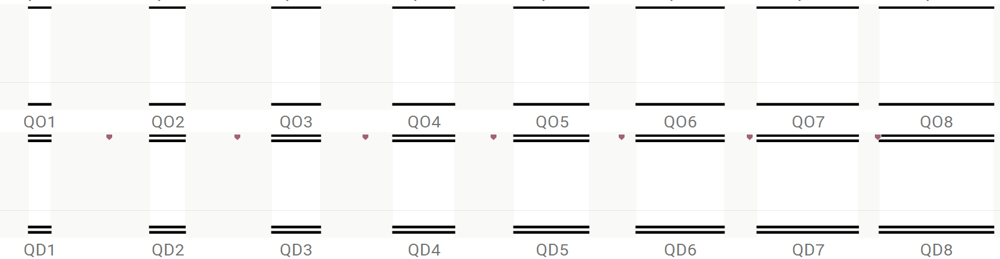
    <figcaption>
        <i>Doubled bases.</i>
    </figcaption>
</figure>

For each cartouche endcap type, glyphs are needed for the three layouts: left-to-right; right-to-left; and vertical. The names are: "cbL" - cartouche being Left; "cbR" - cartouche begin Right; and "cbT" - cartouche begin Top.

<figure>
    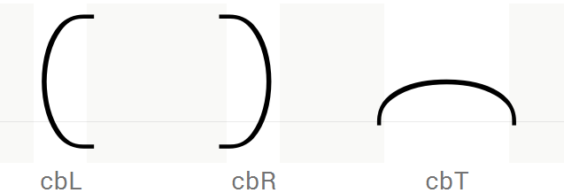
    <figcaption>
        <i>LRT, RTL, and vertical endcaps.</i>
    </figcaption>
</figure>

Corresponding endcaps are needed for the different cartouche types including the HWT enclosures. The names follow the same pattern.

<figure>
    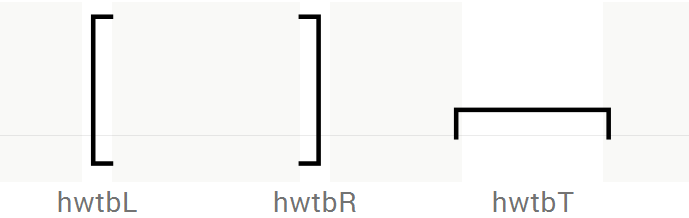
    <figcaption>
        <i>LRT, RTL, and vertical HWT endcaps.</i>
    </figcaption>
</figure>

The end caps for the inner cartouche of the doubled cartouche must include the enclosure line for the outer cartouche:

<figure>
    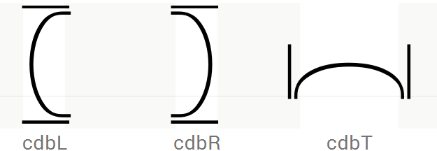
    <figcaption>
        <i>Inner cartouche endcaps.</i>
    </figcaption>
</figure>

#### Guide boxes
To assist typing complex quadrats the font injects guides to show where the next sign will be inserted following a control character. This is done by injecting a guide base "GB1" at the end of a sequence that terminates in a control character. The character "GB1" is then substituted into the appropriately sized form based on the quadrat's composition. It is important to include all size permutations of this character, including 6x6 which is used for overstrikes.

<figure>
    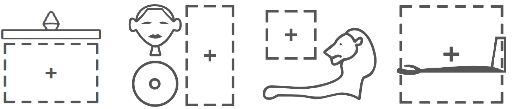
    <figcaption>
        <i>Control guides assist with quadrat composition.</i>
    </figcaption>
</figure>

Guide base size variants are named in the standard pattern, "GB1_" followed by the dimensions of the box, horizontal then vertical:

<figure>
    
    <figcaption>
        <i>Guide box and size variants.</i>
    </figcaption>
</figure>

#### Open segments
Another input assist is the use of colored brackets to indicate when a segment has been opened with the segment begin character (U+13437) but which is not yet closed with a corresponding segment end character (U+13438). The colored brackets are sized to match the area of the target segment. The following illustration shows the build up of a complex quadrat with the open segment indicator showing until the segment end character is added to the sequence.

<figure>
    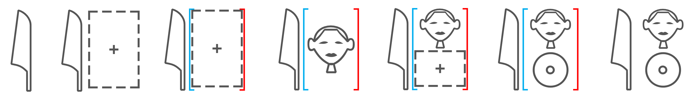
    <figcaption>
        <i>Quadrat build up showing the open segment.</i>
    </figcaption>
</figure>

Open segment glyphs are named in the pattern "es" (<i>extend segment</i>) followed by the size notation for the width and height of the glyph. Because a segment is used to nest a vertical group, there can be no valid segment that is a single unit height. Therefore, the open segment glyphs only need to support sizes from 66 to 21:

<figure>
    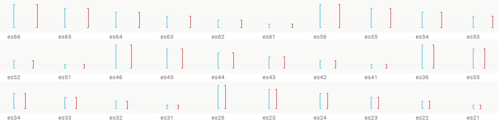
    <figcaption>
        <i>Quadrat build up showing the open segment.</i>
    </figcaption>
</figure>

#### Text critical marks
Egyptological brackets may be used for text critical markup within a quadrat. They adapt in vertical size for the area boundary that they mark. Separate sets of bracket size variants are needed for each nesting level. As such, 18 glyphs are needed for the bracket open. The name convention is: "tcbb" for text critical bracket begin, followed by the level, and the vertical size:

<figure>
    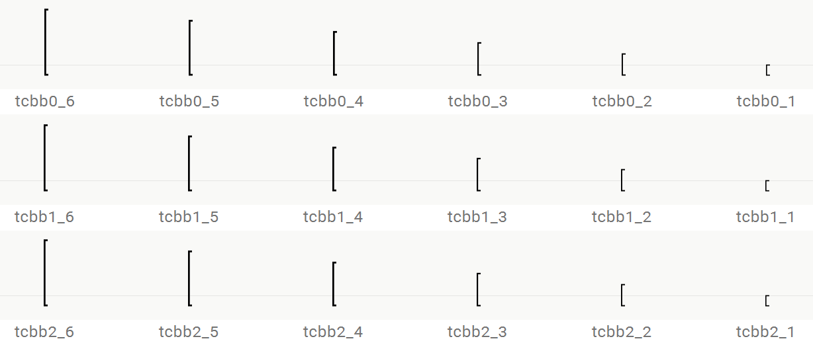
    <figcaption>
        <i>Text critical bracket begin size variations.</i>
    </figcaption>
</figure>

Corresponding beginning and ending sets of size variants must be included in the font for each supported type of Egyptological bracket. The naming prefixes are as follows:

| Sign | Code point | Prefix for size variants |
| ---- | ---------- | ----------- |
| [ | U+005B | tcbb (text critical bracket begin) |
| ] | U+005D | tcbe (text critical bracket end) |
| ⸢ | U+2E22 | tcub (text critical upper-half-bracket begin) |
| ⸣ | U+2E23 | tcue (text critical upper-half-bracket end) |
| ⟨ | U+27E8 | tcab (text critical angle-bracket begin) |
| ⟩ | U+27E9 | tcae (text critical angle-bracket end) |
| { | U+007B | tccb (text critical curly-bracket begin) |
| } | U+007D | tcce (text critical curly-bracket end) |
| ⟦ | U+27E6 | tcrb (text critical rasura-bracket begin) |
| ⟧ | U+27E7 | tcre (text critical rasura-bracket end) |

#### Lost sign size variants

A cross-hatch or diagonal shading can fill an area where a sign has been lost. Four different characters are used to indicate these cases, they have different shaping characteristics as follows:

| Code point | Glyph Name | Unicode Name |
| ---------- | ---------- | ------------ |
| U+13443 | LF1 | Lost sign full| 
| U+13444 | LQ1 | Lost sign quarter |
| U+13445 | LT1 | Lost sign tall |
| U+13446 | LW1 | Lost sign wide |

- LF1 adapts to fill the available size. As such, it is implemented with glyph size variants for each of the 36 possible sizes:

<figure>
    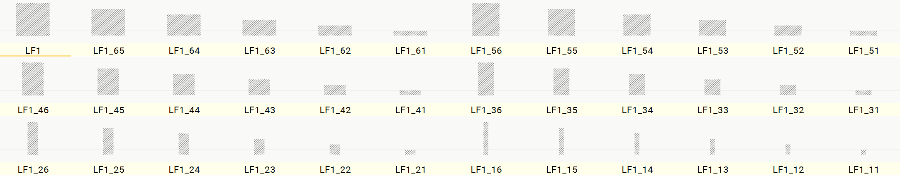
    <figcaption>
        <i>Lost full sign size variants.</i>
    </figcaption>
</figure>

- LQ1 denotes a "quarter"-sized lost sign having a conventional default size of 3 wide and 3 tall. When reduced, it always remains proportionate and so occurs in a limited set of sizes as follows:

<figure>
    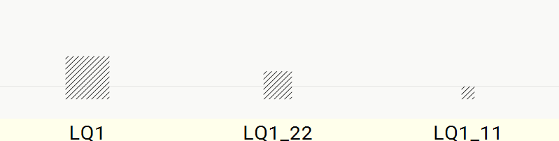
    <figcaption>
        <i>Lost quarter sign size variants.</i>
    </figcaption>
</figure>

- LT1 denotes a lost tall sign having a conventional default size of 3 wide and 6 tall. When reduced it always remains taller than it is wide. It takes the following sizes:

<figure>
    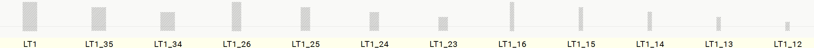
    <figcaption>
        <i>Lost tall sign size variants.</i>
    </figcaption>
</figure>

- LW1 denotes a lost wide sign having a conventional default size of 6 wide and 3 tall. When reduced it always remains wider than it is tall. It takes the following sizes:

<figure>
    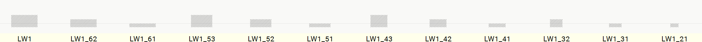
    <figcaption>
        <i>Lost wide sign size variants.</i>
    </figcaption>
</figure>

The lost signs have expanded variants denoted LF2, LQ2, LT2, LW2 (see above [Expanded variants](#expanded-variants) ) with corresponding size variations to support expanding the shading to fill the area boundary between signs.

#### Damaged sign variants

The damaged quarter controls modify a preceding sign. There are 15 visible permutations of the damage quarters. Signs can occur in 36 sizes for the composing quadrats. In addition, size modifiers can occur at 6 units tall for the wider, non-composing signs at width 7 and width 8. Therefore, the 15 damage controls can each occur in 38 possible sizes, consequently, 570 glyphs are needed to support applying any damage modifier as a modifier to any sign.
Damage modifiers are named using the convention: "dq" followed by a digit for the quarter sequence and then the size separated by the underbar:

<figure>
    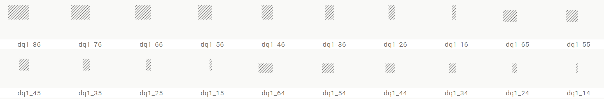
    <figcaption>
        <i>Damaged-quarter size variations.</i>
    </figcaption>
</figure>

#### Ligatures
Ligatures can be defined on-demand to represent a particular combination with higher typographic fidelity than can be achieved with the dynamic construction. Ligatures must be named using a prefix "lig." followed by a period delimited sequence of glyph names based on the glyph sequence they ligate. For example, glyph "lig.G43.te.X1" defines the ligature:
<figure>
    
    <figcaption><i>Ligature of G43, top end insertion, and X1.</i></figcaption>
</figure>

#### Size variants
Size variant glyphs are included in the font so that the OpenType logic can select the largest available glyph that will fit in the host area. For example, the hieroglyph G25 has a natural size 6x6. If this hieroglyph occurs in a block that has only a 4x4 area available to host G25, and the font contains a size variant of G25 called G25_44, it will select that variant to use when rendering the block. Consequently, a font should contain a range of size variant glyphs appropriate to each hieroglyph. There is no minimum requirement for the font to contain such variants. If the OpenType logic determines that a suitably sized glyph is not available in a required size for a given base hieroglyph, it will fall back to a special glyph called "placeholder". The natural size of the placeholder glyph should be 1x1 so that it will fit in any supported size determined by the block structure logic.

<figure>
    
    <figcaption><i>Size variants of G25.</i></figcaption>
</figure>

<figure>
    
    <figcaption><i>Overlaid size variants of G25.</i></figcaption>
</figure>

<figure>
    
    <figcaption><i>The placeholder glyph.</i></figcaption>
</figure>

#### Mirror variants
Mirrored variants are included in the font so that the OpenType logic can support both forced RTL layout, and the mirror control.
- Forced RTL layout mirrors the entire run being forced. The mirroring applies to whole blocks and reflects both the block structure and individual signs. Signs that have horizontal symmetry do not mirror.
- The mirror control applies to the immediately preceding sign only, and does not affect block structures. Signs that have horizontal symmetry do not mirror and the mirror control remains visible in the glyph run.

The signs that mirror horizontally are defined in [featuredata.py](/featuredata.py) mirroring.
 
When both mirror variants and rotational variants are supported by a font, the corresponding set of mirrored forms for the rotational variants should also be included. The set of rotational variants that mirror is defined separately from the mirror variants, in [featuredata.py](/featuredata.py) `mirroredvariants`.

